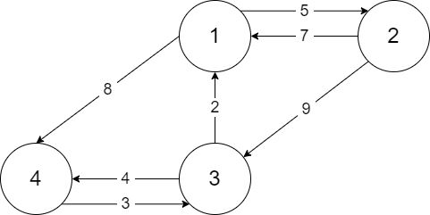

# 최단 경로 알고리즘

**최단 경로 알고리즘**은 주어진 그래프에서 주어진 두 정점을 연결하는 가장 짧은 경로의 길이를 찾는 알고리즘입니다.

가중치가 없는 그래프에서는 너비 우선 탐색으로 구할 수 있었습니다.

여기서는 가중치가 있는 그래프만을 다루며, 음수 가중치를 갖는 간선이 있을 수 있습니다.

**다만, 음수 사이클이 존재하는 경우 최단 거리를 구할 수 없습니다.**

 

최단 경로 알고리즘은 **단일 시작점 알고리즘**과 **모든 쌍 알고리즘**으로 나뉩니다.

 

**단일 시작점 알고리즘**은 너비 우선 탐색을 기반으로 설계돼 있습니다.

하나의 시작점과 그 시작점으로부터 나머지 각 정점들까지의 최단 거리를 모두 구합니다.

계산 결과는 $V$ 크기의 1차원 배열이 됩니다.

 

**모든 쌍 알고리즘**은 모든 정점의 쌍에 대해 최단 거리를 계산합니다.

모든 정점들 간의 최단 거리를 모두 계산합니다.

계산 결과는 $V \times V$ 크기의 2차원 배열이 됩니다.

 

또한, 우리가 다룰 알고리즘들은 모두 방향 그래프를 기준으로 동작합니다.

무방향 그래프의 최단 거리를 구하려면 양방향 간선을 두 개의 일방향으로 쪼개면 됩니다.

이 때, 무방향 음수 간선이 있으면 음수 사이클이 발생하므로 최단 경로를 구할 수 없습니다.

 

## 다익스트라

**다익스트라 알고리즘**은 단일 시작점 최단 경로 알고리즘입니다.

음수 간선이 없는 경우에만 사용할 수 있습니다.

기본적인 아이디어는 너비 우선 탐색과 동일하며, 너비 우선 탐색과 달리 *우선순위 큐*를 사용합니다.

정점의 개수가 $V$, 간선의 개수가 $E$일 때, 다익스트라 알고리즘의 시간복잡도는 $O(ElgV)$입니다.

 

### 작동방식

우선순위 큐에는 정점과, 시작점으로부터 그 정점까지의 최단거리 값이 한 쌍으로 들어갑니다.

그리고 최단거리 값의 오름차순으로 정렬이 됩니다.

맨 처음에는 시작점과 0의 값이 한 쌍으로 들어갑니다.

그리고 인접한 정점들을 모두 검사하며 최단거리를 갱신하고, 우선순위 큐에 넣어줍니다.

구체적으로는 아래의 과정을 거칩니다.

1. 시작점으로부터 각 정점까지의 최단 거리를 저장하는 배열 `dist[]`를 `inf`로 초기화합니다.
1. `dist[src]`의 값을 `0`으로 대입합니다. (시작점)
1. 우선순위 큐에 `(src, 0)`을 삽입합니다.
1. 우선순위 큐가 다 비어질 때까지 다음을 반복합니다.
   1. 우선순위 큐에서 현재 정점과 현재 최단 거리 쌍을`(here, cost)` 꺼냅니다.
   1. 만약 `dist[here]`가 현재 `cost`보다 작다면 지금 꺼낸 것을 무시합니다.
   1. 현재 정점에 인접한 정점들을 모두 검사합니다.
      1. 이웃 정점(`there`)까지의 거리를 갱신합니다.
      1. 그 거리가 `dist[there]`에 저장된 값보다 짧다면 우선순위 큐에 해당 정점을 삽입합니다.
1. 위 과정을 마치면 `dist[]`에는 최단 거리가 모두 저장됩니다.

[이러한 과정을 잘 보여주는 그림을 봅시다.](https://m.blog.naver.com/kks227/220796029558?view=img_1)

[코드는 이렇게 작성됩니다.](dijkstra.cc)

## 벨만-포드

**벨만 포드 알고리즘**은 단일 시작점 최단 경로 알고리즘입니다.

그래프에 음수 간선이 있어도 사용할 수 있으며, 심지어 음수 사이클이 있어도 이를 알아낼 수 있습니다.

다익스트라 알고리즘에서는 모든 정점을 단 한 번씩만 방문하여 최단 경로를 확정했었습니다.

벨만 포드 알고리즘에서는 이와 달리 모든 간선을 최대 $V$번 순회하여 최단 경로를 갱신해 나갑니다.

 

시작 정점에서 가장 먼 정점이더라도 그 둘을 잇는 간선의 개수는 최대 $V-1$개입니다.

만약 그래프가 연결 리스트처럼 일자로 늘여져 있는 경우를 고려해봅시다.

그리고 간선들의 순회 순서가 $(c, u)$, $(b, c)$, $(a, b)$, $(s, a)$라고 해봅시다.

실제로 시작 정점이 0번째라는 보장은 없기에 이런 경우가 있을 수 있습니다.

위의 경우 각 순회마다 하나의 정점씩만 최단 경로로 확정되어 갱신될 것입니다.

그렇더라도 마지막 $u$ 정점이 확정되기 까지는 $V-1$번의 순회만 거치면 됩니다.

$V$ 번째 순회에서는 어떤 갱신도 일어나지 않습니다.

따라서 벨만 포드 알고리즘에서는 최대 $V-1$번으로 최단 경로를 구할 수 있습니다.

 

그런데 만약, 아래처럼 음수 사이클이 있는 경우라면 이야기가 달라집니다.

$(a, b) \rightarrow (b, c) \rightarrow (c, a)$ 의 사이클을 돌 때마다 최단 경로가 게속 갱신됩니다.

이 경우 $V-1$ 번의 순회를 마친 후 $V$ 번째 순회에도 최단 경로가 갱신됩니다.

즉, $V$ 번째 순회에서 갱신이 일어나는지 여부로 음수 사이클의 여부를 알 수 있습니다.

결론적으로, 벨만 포드 알고리즘의 시간 복잡도는 $O(VE)$입니다.

 

[코드는 이렇게 작성됩니다.](bellmanFord.cc)

 

## 플로이드 워셜

**플로이드 워셜 알고리즘**은 모든 쌍 최단 거리 알고리즘입니다.

이 알고리즘은 두 정점 $u, v$를 잇는 경로에 다른 정점을 경유하여 경로를 갱신하는 방식으로 작동합니다.

모든 정점 쌍에 대해 그 둘을 잇는 경로에 다른 정점을 경유시킴으로써 경로를 갱신합니다.

따라서 이 알고리즘의 시간 복잡도는 $O(V^3)$이 됩니다.

 

> 초기상태

|     | 1   | 2   | 3   | 4   |
| --- | --- | --- | --- | --- |
| 1   | 0   | 5   | INF | 8   |
| 2   | 7   | 0   | 9   | INF |
| 3   | 2   | INF | 0   | 4   |
| 4   | INF | INF | 3   | 0   |

> 1번 정점을 거쳐가는 경우

|     | 1   | 2   | 3   | 4   |
| --- | --- | --- | --- | --- |
| 1   | 0   | 5   | INF | 8   |
| 2   | 7   | 0   | 9   | INF |
| 3   | 2   | INF | 0   | 4   |
| 4   | INF | INF | 3   | 0   |

2 → 4의 비용이 지금은 INF인데, 2 → 1 → 4의 비용은 7 + 8 = 15입니다.

그러면, 기존보다 더 짧은 경로를 찾은 것이므로 갱신됩니다.

|     | 1   | 2   | 3   | 4      |
| --- | --- | --- | --- | ------ |
| 1   | 0   | 5   | INF | 8      |
| 2   | 7   | 0   | 9   | **15** |
| 3   | 2   | INF | 0   | 4      |
| 4   | INF | INF | 3   | 0      |

... 이를 반복하면 아래처럼 최단 경로 테이블이 완성됩니다.

 

[코드는 이렇게 작성됩니다.](floyd.cc)

 

## 참고자료

[다익스트라 알고리즘(Dijkstra's Algorithm) - kks227](https://blog.naver.com/kks227/220796029558)

[벨만 포드 알고리즘(Bellman-Ford Algorithm) - kks227](https://blog.naver.com/kks227/220796963742)

[플로이드 와샬 알고리즘(Floyd-Warshall Algorithm) - kks227](https://blog.naver.com/kks227/220797649276)

[24. 플로이드 와샬(Floyd Warshall) 알고리즘 - ndb796](https://blog.naver.com/ndb796/221234427842)

## 문제 풀이

> ### 관련 문제 목록 바로가기
>
> [solved.ac](<https://solved.ac/search?query=(%23dijkstra%20%7C%20%23floyd_warshall%20%7C%20%23bellman_ford)>)
> |
> [LeetCode](https://leetcode.com/problemset/all/?topicSlugs=shortest-path)

김하진:

김재헌:

박상준:

박진영:

서민혁:

유태정:

이재혁:

이성구:

조민준:

정준우:

한태혁:
