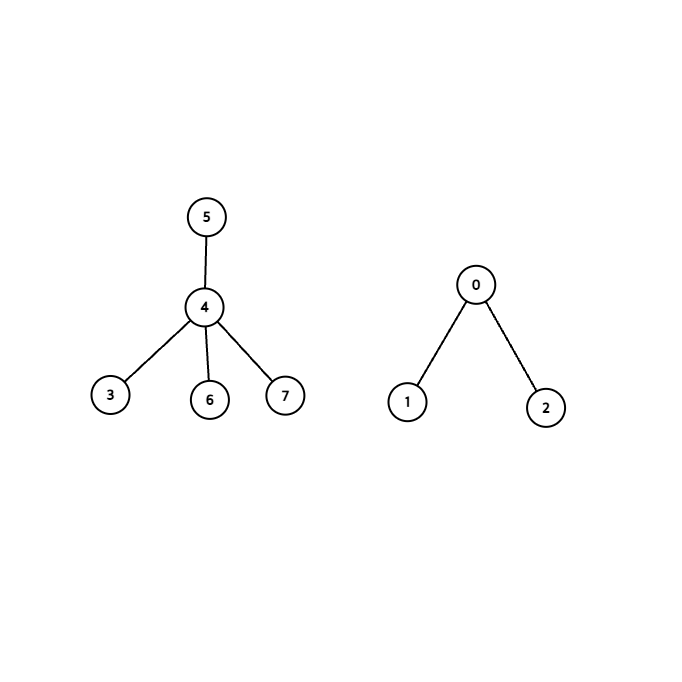
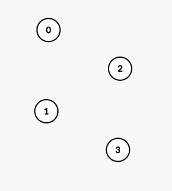
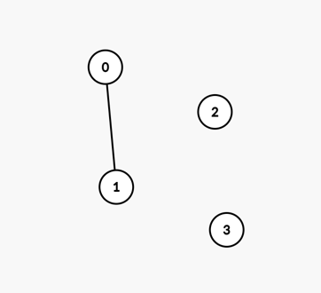
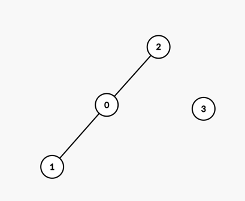
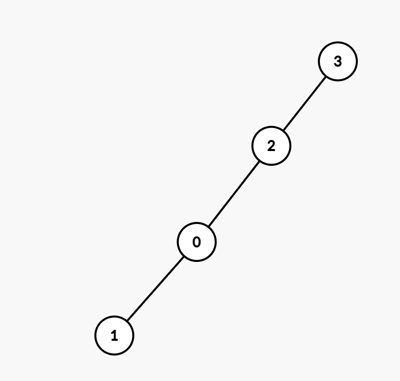
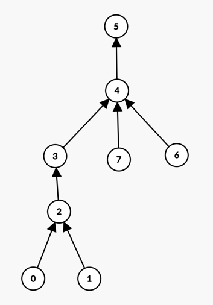

# 상호 배타적 집합

## 유니온 파인드 (Union-Find)
상호 배타적 집합을 표현하기 위해서 유니온 파인드 자료구조가 사용된다.

### 세 가지 단계
1. 초기화:  n개의 원소를 각각 n개의 집합에 포함되어 있도록 초기화
2. 합치기(union): 두뭔소 a, b가 주어졌을때, 이들이 속합 두집합을 하나로 합침
3. 찾기(find): 어떤 원소 a가 주어질 때 이 원소가 속한 집합을 반환


### 배열을 활용

```markdown
belongTo[i]=(i번 원소가 속하는 집합의 번호)
```
위와 같은 배열(belongTo)를 만들고 사용합니다.
- 초기화: (`belongTo[i]=i`)
- 찾기: `belongTo[i]` `O(n)`
- 합치기: 모든 원소를 순회하면서 한쪽 집합에 속한 원소들을 다른쪽 집합으로 이동시켜야하는데,
모든 원소를 순회하는데 `O(n)`만큼의 시간이 걸리다보니까 좀더 빨라질수 있는 방식을 찾아야함

### 트리를 활용
한집합에 속하는 원소들을 하나의 트리로 묶어 줍니다
- ex) 원소 8개 


두 원소가 같은 트리에 속해 있는ㄴ지 확인하는 가장 직관적인 방법은 각 원소가 포함된 트리의 루트를 찾은 뒤 이들이 같은지 비교하는 것입니다. 트리와 루트는 항상 1:1 대응이기 때문에 루트가 같다면 두 노드가 같은 트리에 속해있음을 자명해줍니다.
그러므로 트리의 루트를 집합의 대표라고 부릅시다.

위 예시에서 "3"이 속한 집합의 대표는 "5"이고, "0"이 속한 집합의 대표는 "0"이 됩니다.

이제 찾기(Find)연산은 이 집합의 대표(트리의 루트노드)찾기가 됩니다.

### 찾기 연산 구현
- 모든 자식 노드는 부모에 대한 포인터를 가짐
- 루트는 자기자신을 가리킴

### 합치기 연산 구현
- 주어진 원소 a,b의 루트를 구함 (A', B')
- A'를 B'의 자식노드로 설정

```
//트리를 이용한 상호 배타적 집합 구현
struct NaiveDisjointSet {
  vector<int> parent;
  NaiveDisjointSet(int n): parent(n) {
    for(int i = 0; i < n; i++) {
      parent[i] = i; 
    }
  }
  
  //u가 속한 트리의 루트의 번호를 반환
  int find(int u) const {
    if (u == parent[u]) return u;
    return find(parent[u]);
  }
  
  //u, v의 트리를 합치기
  void emrge(int u, int v) {
    u = find(u); v = find(v);
    if(u == v) return;
    parent[u] = v; 
  }
}
```

- `find()`함수는 트리의 높이에 비례한 시간이 걸린다.
- `merge()` 함수도 사실상 find 만사용했기때문에 같은 시간이 걸린다.

### 최적화
위의 로직을 그대로 구현하게 된다면 문제가 발생할수있습니다. 계속해서 하나짜리 집합에 다른 집합을 합친다고 가정한다면,






위와같이 결국 Linked list와 다를바 없는 형태가 될수 있습니다.

### 해결법 union by rank
항상 높이가 낮은 트리를 높이가 높은 트리쪽에 합친다.

```
struct OptimizedDisjointSet {
  vector<int> parent, rank;
  OptimizedDisjointSet(int n): parent(n), rank(n, 1) {
    for(int i = 0;i <n;+i) {
      parent[i]= i;
    }
  }
  //형태가 바뀐건 뒤에서 살펴보겠습니다.
  int find(int u) {
    if(u == parent[u]) return u;
    return parent[u] = find(parent[u]);
  }
  
  void merge(int u, int v) {
    u = find(u); v = find(v);
    if(u == v) return;
    if(rank[u] > rank[v]) swap(u,v);
    //rank[v]가 rank[u]이상이므로 u를 v의 자식으로 넣는다.
    parent[u] = v;
    if(rank[u] == rank[v]) ++rank[v];
  }
}
```

- 두 트리의 높이가 같을때만 증가하므로, 높이가 h인 트리가 생기기 위해서는 높이가 (h-1)인 두 트리가 필요
- (h-1)의 높이인 트리가 생기기 위해 최소 x개의 노드가 필요하다면, h인 높이의 트리가 생기기 위해선 2x의 노드가 필요.
- 트리의 높이는 포함한 노드의 수의 로그에 비례
- 합치기, 찾기 연산의 시간복잡도가 이제 O(lgN)

### 최적화 경로 압축
"찾기 연산이 중복된 계산을 여러번 하고 있다" 에서 착안된 최적화.
- `find(u)`를 통해 u가 속한 트리의 루트 찾아냄
- `parent[u]`를 찾아낸 루트로 아예 바꿔버리면 다음 번에 `find(u)`를호출했을때 바로 루트로 접근이 됨.
- 위 예제에서 find의 형태로 변경하면 이 최적화도 완료.
- 아래는 `find(0)`을 했을때 이뤄지는 최적화



## 예제 그래프의 연결성 확인
N개의 도시가 도로망으로 연결되어 있는데, 각 도로는 정확히 두개의 도시를 연결, 그런데 이들이 폭설로 인해 모두 마비되었다고 합시다. 시간이 지남에 따라 하나하나 도로들이 복구되는데, 도로가 복구될때마다 임의의 두 도시 간에 서로 왕래가 가능한지를 알고 싶다..

각 도시를 원소로 하고, 서로 왕래가 가능한 도시들을 하나의 집합으로 표시. 두 도시 a, b를 연결하는 도로가 복구되었으면 원래 a에 연결되어있던 도시들과 b에 연결되어있던 도시들 또한 이 도로를 통해 왕래가 가능. 따라서 두 집합을 합치면 된다.
다음에 살펴볼 크루스칼의 최소 스패닝 트리 알고리즘이 상호배타적 집합을 이용해 이와같은 문제를 해결하는 대표적인 사례라고 합니다.
## 예제 가장 큰 집합 추적

각 집합에 속한 원소의 수를 추적, `rank`배열을 추가한것처럼 트리의 노드 수를 담는 배열 `size`배열 추가 이제 두 집합이 합쳐질때마다 이값을 갱신해주면된다. 가장 큰 집합이 어떻게 변해가는지를 추적하거나, 과반수가 넘는 시점을 찾는다거나하는 작업을 쉽게 수행할수 있게된다.

--- 

문제 풀이
관련 문제 목록 바로가기
[solved.ac | LeetCode](https://solved.ac/search?query=%23disjoint_set+-%23mst&sort=solved&direction=desc&page=1)

김하진: 

김재헌: 

박상준: 

박진영: 

서민혁: https://www.acmicpc.net/problem/16402

유태정: https://www.acmicpc.net/problem/17352

이재혁: https://www.acmicpc.net/problem/16562

이성구: https://www.acmicpc.net/problem/1976

조민준: https://www.acmicpc.net/problem/15956

정준우:

한태혁: https://leetcode.com/problems/checking-existence-of-edge-length-limited-paths/submissions/


